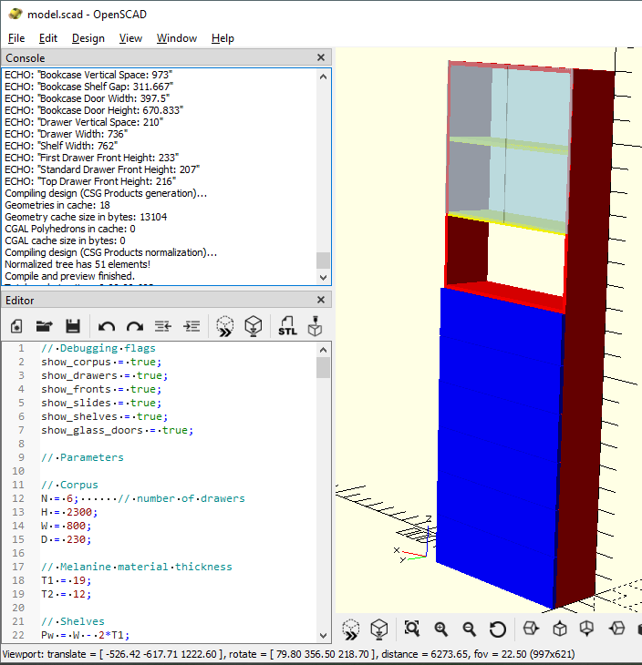

# Chest of Drawers Bookcase

This project is a parametric 3D model of a chest of drawers with an integrated bookcase, designed in OpenSCAD.

## Overview

The model is a highly customizable piece of furniture that combines a six-drawer chest with a three-tier bookcase, enclosed by a pair of glass doors. The entire design is parametric, meaning its dimensions and features can be easily modified by changing variables in the source code. The model is designed with realistic construction details in mind.

## Key Features

*   **Parametric Design:** Easily change the height, width, depth, and material thicknesses by editing the variables at the top of the `model.scad` file.
*   **Realistic Construction:** The model incorporates practical construction details, including a robust drawer assembly, a 3mm HDF back panel, and the precise, flush alignment of internal components like drawers and slides. It also includes pilot holes for the confirmat screws used for corpus assembly.
*   **Modular Structure:** The code is organized into logical, reusable modules for each component (e.g., corpus, drawers, shelves), making it clean and easy to understand.
*   **Debugging Friendly:**
    *   **Component Toggles:** Use boolean flags (e.g., `show_corpus`, `show_drawers`) to selectively render different parts of the model, simplifying inspection and debugging.
    *   **Console Output:** Key calculated dimensions are automatically printed to the OpenSCAD console, allowing for quick verification of the model's geometry.
*   **Descriptive Naming:** All variables use clear, descriptive names (e.g., `corpus_height`, `drawer_gap`) to enhance code readability and maintainability.

## Usage

1.  Open the `model.scad` file in [OpenSCAD](https://openscad.org/).
2.  Modify the parameters in the "Parameters" section to customize the design.
3.  Use the boolean flags in the "Debugging flags" section to show or hide specific components.
4.  Check the OpenSCAD console to see the calculated dimensions of the components.

For a complete breakdown of the design decisions, parameters, and code structure, please see the detailed [Model Description](prompt/model-v2.md).
