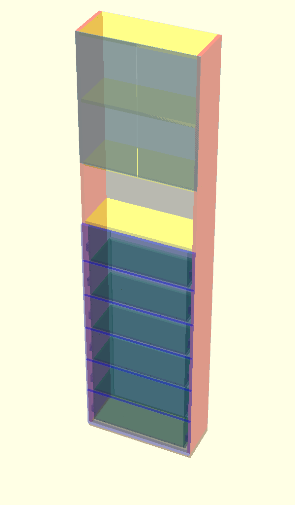

# Vibe Coding Furniture: Chest of Drawers Bookcase

This project contains the OpenSCAD code for a chest of drawers with an integrated bookcase.

## Prerequisites

- [Git](https://git-scm.com/downloads/win)
- [Node.js](https://nodejs.org/en/download/)
- [ezdxf](https://pypi.org/project/ezdxf/)
- [openpyxl](https://pypi.org/project/openpyxl/)
- [ODA File Converter](https://www.opendesign.com/guestfiles/oda_file_Converter)
- [LibreCAD](https://github.com/LibreCAD/LibreCAD/releases)
- [OpenSCAD](https://openscad.org/downloads.html#windows)
- [OpenSCAD (Nightly Build)](https://openscad.org/downloads.html#snapshots)
- [Gemini CLI](https://github.com/google-gemini/gemini-cli)
- [Visual Studio Code](https://code.visualstudio.com/)
- VS Code Extensions
    - Gemini Code Assist
    - Gemini CLI Companion
    - OpenSCAD

## Files

*   `model.scad`: The main OpenSCAD file containing the 3D model of the furniture.
*   `prompt/model.md`: The detailed instructions and dimensions used to generate the `model.scad` file.
*   `prompt/model-v2.md`: The updated instructions and dimensions for the v2 model.
*   `ps-modules/CommonFunctions.psm1`: A PowerShell module containing common functions used by the other scripts.
*   `artifacts/conversation.md`: A log of the conversation with Gemini CLI.
*   `workflow.ps1`: Orchestrates the entire workflow for generating various outputs from the OpenSCAD model.
*   `generate-csv.ps1`: Generates a CSV file with panel information.
*   `export-all.ps1`: Automates the export of all panels to various formats.
*   `export-panels.ps1`: Exports panels to a specific format (STL, DXF, SVG).
*   `run-split-layers.ps1`: Executes the `split-layers-dxf.ps1` script and logs the output.
*   `split_layers.py`: Python script to split DXF layers, add a title, annotations, a legend, a hole schedule and dimensions.
*   `convert-dxf-to-dwg.ps1`: Converts DXF files to DWG format using the ODA File Converter.
*   `convert-dxf-to-pdf.ps1`: Converts DXF files to PDF format using LibreCAD.
*   `create_order.py`: A Python script to generate an order document for the Iverpan cutting service.

## Model Description

The 3D model is a chest of drawers with an integrated bookcase. The design is parametric and all dimensions are derived from the main dimensions.

### Main Dimensions

*   **Corpus:**
    *   corpus_height = 2300
    *   corpus_width = 600
    *   corpus_depth = 230
*   **Melanine material thickness:**
    *   melanine_thickness_main = 18
    *   melanine_thickness_secondary = 10
*   **HDF Back Panel:**
    *   hdf_thickness = 3
*   **Pedestal:**
    *   pedestal_height = 30
*   **Shelves:**
    *   shelf_width = corpus_width - 2*melanine_thickness_main
    *   shelf_depth = corpus_depth
*   **Slides:**
    *   slide_width = 200
    *   slide_height = 45
    *   slide_depth = 13
*   **Drawers:**
    *   number_of_drawers = 6
    *   drawer_height = 200
    *   drawer_body_height = drawer_height - melanine_thickness_secondary
    *   drawer_depth = corpus_depth - 5
    *   drawer_width = shelf_width - 2*slide_depth
    *   drawer_body_width = drawer_width - 2*melanine_thickness_secondary
    *   drawer_bottom_offset = 10
    *   drawer_gap = 10
*   **Drawer Fronts:**
    *   front_gap = 3
    *   front_overhang = 3
    *   front_margin = 1.5
    *   front_width = corpus_width - 2 * front_margin
    *   front_height_base = drawer_height + drawer_gap - front_gap
    *   front_height_first = melanine_thickness_main + drawer_bottom_offset - front_gap + front_height_base
    *   front_height_standard = front_height_base
    *   front_height_top = front_height_standard + 3*front_overhang
*   **Bookcase Glass Doors:**
    *   bookcase_glass_door_width = (corpus_width - (1 + front_gap + 1))/2
    *   bookcase_glass_door_height = melanine_thickness_main + bookcase_shelf_gap + melanine_thickness_main + bookcase_shelf_gap + melanine_thickness_main/2
    *   bookcase_glass_door_tickness = 4
*   **Joinery:**
    *   confirmat_screw_length = 49
    *   confirmat_hole_diameter = 4
    *   confirmat_hole_edge_distance = 50
    *   dowel_diameter = 6
    *   dowel_length = 30
    *   dowel_hole_depth_in_front = 10
    *   dowel_hole_edge_distance = 50
    *   panel_length_for_four_dowels = 500
    *   slide_pilot_hole_depth = 2
    *   slide_pilot_hole_diameter = 2.5
    *   drawer_slide_pilot_hole_offsets = [37, 163]
    *   corpus_slide_pilot_hole_offsets = [6.5, 35, 51, 76, 99, 115]

### Structure

*   **Corpus:** The corpus is made of `melanine_thickness_main` thick melanine and consists of two sides, a top, a bottom and a middle plate. The corpus is divided into two compartments. The bottom compartment contains six drawers and the top compartment is a bookcase with two shelves.
*   **Drawers:** The drawers are made of `melanine_thickness_secondary` thick melanine and are mounted to the sides of the corpus with slides. Each drawer has a front panel made of `melanine_thickness_main` thick melanine. Dowel holes are included in the side and bottom panels for joining with the front panels. The drawer assembly has been fixed, and handle holes have been added to the drawer fronts.
*   **Shelves:** The bookcase has two shelves made of `melanine_thickness_main` thick melanine.
*   **HDF Back Panel:** A 3mm HDF back panel is attached to the back of the corpus.
*   **Pedestal:** A 30mm high pedestal is placed under the corpus.
*   **Glass Doors:** The bookcase section is enclosed by two glass doors.
*   **Joinery:** Confirmat screws (4.8mm x 49mm) are used to join the corpus panels and shelves. 4mm pilot holes for these screws are included in the model. The drawer components are also joined with these screws, with the number of screws depending on the panel length (2 for <50cm, 3 for >=50cm) and placed 5cm from the edge. Wooden dowels (phi 6 mm x 30 mm) are used to join the front panels to the drawer boxes. The front's blind hole is 1cm deep. There are two dowels per panel per side if the panel length is less than 50cm, and four dowels if longer, with even spacing. The hole locations are 5cm from the edge. Pilot holes for mounting the drawer slides are included in both the drawer sides and the corpus sides. These holes are 2mm deep and 2.5mm in diameter. In drawer sides, there are two holes per slide, located 37mm and 163mm from the front edge. ... In corpus sides, there are six holes per slide, located 6.5mm, 35mm, 51mm, 76, 99mm, and 115mm from the front edge.

### Cut List Generation

The model can generate a CSV cut list for all panels. This is controlled by the `generate_cut_list_csv` variable in `model.scad`. A PowerShell script, `generate-csv.ps1`, is provided to automate the process of generating the `artifacts/cut_list.csv` file.

### Order Generation

A Python script, `create_order.py`, is provided to automate the creation of an order document for a cutting service. The script uses the generated cut list CSV file and an Excel template to create a new Excel file with the order details.

### CNC Export

The project includes a workflow for exporting 2D panel drawings in DXF format, suitable for CNC cutting services. The `export-panels.ps1` script automates the export of all panels, and the `run-split-layers.ps1` script (which calls `split-layers-dxf.ps1` and `split_layers.py`) post-processes the DXF files to separate geometry into `CUT`, `DRILL`, and `DIMENSION` layers, and adds annotations for holes. The exported panels are positioned at the origin (0,0) to ensure consistency. The annotations include a detailed "Hole Schedule" table with the hole name, diameter, depth, and its X, Y, and Z coordinates.

#### DXF Post-processing

The `split_layers.py` script performs several post-processing steps on the DXF files generated by OpenSCAD:
*   It separates entities into `CUT`, `DRILL`, `DIMENSION`, and `ANNOTATION` layers.
*   It adds detailed hole annotations and a hole schedule table.
*   It detects and converts circle-like polylines into true `CIRCLE` entities to address a common OpenSCAD export issue where circles are exported as segmented polylines.
*   It classifies small `ARC` entities as drill holes.

#### DXF to DWG Conversion

The `split-layers-dxf.ps1` script also handles the conversion of the layered DXF files to DWG format using the ODA File Converter in batch mode.

#### DXF to PDF Conversion

A PowerShell script, `convert-dxf-to-pdf.ps1`, is provided to convert the layered DXF files to PDF format using LibreCAD.

#### Printing Drilling Templates

The generated PDF templates can be printed to scale and used as physical templates for drilling. Here's how to do it using LibreCAD's built-in print tiling feature. For more details, see the [LibreCAD documentation](https://docs.librecad.org/en/2.2.0_a/guides/completion.html#print-preview-window).

1.  **Set up your paper size:**
    *   Go to `File` → `Print Preview`.
    *   Click the `Options` toolbar icon (looks like a gear ⚙️).
    *   Under `Paper`, choose:
        *   `A4`
        *   `Orientation`: `Portrait` or `Landscape` depending on your drawing.
        *   Set `Margins` to small values (e.g., 3-5 mm).

2.  **Set scale:**
    *   In `Print Preview`, check `Fixed` and set `Scale = 1.0` (for 1:1).

3.  **Move the drawing into position:**
    *   Use the `Move/Drag` tool in `Print Preview` to shift the viewport.
    *   Position the first A4 sheet over the area you want to print.

4.  **Print to PDF:**
    *   Click `Print` → choose 'Microsoft Print to PDF' (or another PDF printer).
    *   Name it e.g. `part_01.pdf`.

5.  **Repeat for other tiles:**
    *   Shift the viewport by exactly one A4 page width or height each time.
    *   Print again (e.g. `part_02.pdf`, `part_03.pdf`, etc.).
    *   You can overlap slightly if needed to ensure continuity.

## Changelog

### v27

*   **Bug Fixes:**
    *   Fixed a bug in `drawer_front_drill` and `drawer_front_hole_metadata` where the X-coordinates for drawer side dowel holes were aligned with the inner faces rather than the center of the panel thickness. The holes are now correctly centered.
*   **Test Scripts:**
    *   Added `test/test-drawer-front-alignment.ps1` to verify the X-axis alignment of drawer front holes with the drawer box assembly.

### v26

*   **Bug Fixes:**
    *   Fixed the vertical offset of dowel holes in drawer front panels (`DrawerFrontBottom`, `DrawerFrontStandard`, `DrawerFrontTop`) and related templates (`DrawerFrontOutsideTemplate`). The holes are now correctly shifted by the `front_overhang` (3mm) plus any drawer offset, ensuring they align perfectly with the corresponding holes in the drawer side panels.
*   **Order Generation:**
    *   Updated `create_order.py` to use `HDF-3-Bijela` (White HDF) instead of `HDF-3-Hrast` for the Iverpan cutting service.
*   **Test Scripts:**
    *   Added `test/test-front-overhang.ps1` to verify the drawer front hole offsets.

### v25

*   **Template Panels:**
    *   Increased the height of `CorpusShelfTemplate` by `melanine_thickness_main` to facilitate sequential placement for drilling shelf holes in the corpus side.

### v24

*   **Template Panels:**
    *   Added `DrawerFrontOutsideTemplate` panel.
    *   Renamed `DrawerFrontTemplate` to `DrawerFrontInsideTemplate`.

### v23

*   **Template Panels:**
    *   Added handle holes to the `DrawerFrontInsideTemplate` panel.
*   **Test Scripts:**
    *   Added `test/test-drawer-front-template.ps1` to test the export of the `DrawerFrontInsideTemplate` panel.

### v22

*   **Bug Fixes:**
    *   Fixed a bug where the bottom hole for connecting the drawer side to the back panel was incorrectly positioned at 50mm from the edge, causing interference with the slide mechanism. The hole is now correctly positioned at 35mm from the edge.
*   **Model Parameterization:**
    *   Updated `drawer_slide_pilot_hole_offsets` from `[37, 165]` to `[37, 163]`.

### v21

*   **Model Parameterization:**
    *   Updated `drawer_slide_pilot_hole_offsets` from `[35, 163]` to `[37, 165]`.
*   **OpenSCAD Output:**
    *   Added `model_info` object to console output for structured parameter access.
    *   Prefixed cut list entries with `CSV:` for easier parsing.
    *   Prefixed panel names with `panel=` and model identifier with `model_identifier=` in console output.
*   **PowerShell Scripts:**
    *   All PowerShell scripts now use `Import-Module -Force` to ensure the latest module changes are always loaded.
*   **DXF Export:**
    *   Removed 3D object generation from `pedestal_side_template_hole_metadata` to fix DXF export issues.
    *   Updated `split_layers.py` to expect `nx,ny,nz` in hole metadata CSV.
*   **PowerShell Modules:**
    *   Improved parsing logic in `Get-ModelIdentifier` and `Get-PanelNames` in `CommonFunctions.psm1` for robustness against OpenSCAD output variations.
*   **Test Scripts:**
    *   Added `test/get-export-folder.ps1`, `test/export-panel.ps1`, and `test/get-panel-names.ps1`.
    *   Normalized export folder path in `test/get-export-folder.ps1`.

### v20

*   **DXF Export:**
    *   Added unit vector components (nx, ny, nz) to the hole metadata CSV export, indicating the normal vector of the panel surface at the hole location.

### v19

*   **DXF Export:**
    *   Moved the legend below the "Hole Schedule" table and matched the font size for better readability.
    *   The legend title font size is now the same as the "Hole Schedule" title.

### v18

*   **DXF Export:**
    *   Added a new `DRILL_MARKS` layer to display black crosshair markers for planar drill holes, distinguishing them from side-drilled holes.
    *   Added a `--template` flag to `split_layers.py` to generate a clean DXF output without dimension lines, title, legend, or hole schedule, suitable for use as a drilling template.

### v17

*   **Model Parameterization:**
    *   Changed `melanine_thickness_main` from 19 to 18.
    *   Changed `melanine_thickness_secondary` from 12 to 10.
*   **Order Generation:**
    *   Updated `create_order.py` to correctly handle banding for the 'Sizekupres' service.
    *   Updated material codes for the 'Elgrad' service.
*   **Template Panels:**
    *   Changed the material for template panels from 12mm to 18mm melanine.

### v16

*   **Order Generation:**
    *   Added support for the 'Sizekupres' cutting service in `create_order.py`.
*   **Workflow:**
    *   The `workflow.ps1` script now automates the generation of order files for all supported cutting services.
*   **DXF Processing:**
    *   Fixed a bug in `split_layers.py` where `LINE` entities for holes were not being correctly identified due to a strict `isclose()` tolerance. A tolerance is now used to correctly match line segments.

### v15

*   **Template Panels:**
    *   Added `PedestalSideTemplate`, `DrawerBackTemplate`, and `DrawerSideTemplate`.
    *   Fixed missing slide mount pilot holes in `DrawerSideTemplate`.
*   **DXF Export:**
    *   Increased the circle segment count (`$FN`) to 100 in `model.scad` to improve circle quality in DXF exports.
    *   In `split_layers.py`, implemented a feature to detect and convert circle-like polylines into true `CIRCLE` entities, addressing an OpenSCAD export issue.
    *   Small `ARC` entities are now correctly classified to the `DRILL` layer.
    *   Changed the `DIMENSION` layer color to grey and the `ANNOTATION` layer color to black for better visibility.
    *   The dimension text is now placed above the dimension line, and the line does not cross over the text.
*   **Debugging:**
    *   Added a statistics generation feature to `split_layers.py` to provide an overview of DXF entity types and sizes upon processing.

### v14

*   **Order Generation:**
    *   Refactored `create_order.py` to support the 'Furnir' cutting service.
    *   The material definitions are now in a nested dictionary `MATERIAL` to support multiple services.
*   **Configuration:**
    *   Added `.vscode` to the `.gitignore` file.

### v13

*   **Model Parameterization:**
    *   Changed `melanine_thickness_main` from 19 to 18.
*   **DXF Export:**
    *   Corrected the 2D projection for `DrawerSideLeft`, `DrawerSideRight`, and `DrawerBack` panels to ensure correct orientation and placement in the first quadrant.
    *   Updated the hole metadata functions (`get_drawer_side_hole_2d_coords`, `get_drawer_back_hole_2d_coords`) to match the new projections.
*   **Bug Fixes:**
    *   Fixed an incorrect hole position in the `drawer_side_drill` and `drawer_side_hole_metadata` modules for the rear confirmat screw connecting the drawer side to the bottom panel.
*   **Order Generation:**
    *   Refactored `create_order.py` to support multiple materials for the Elgrad cutting service.
*   **Documentation:**
    *   Updated `export-panels.ps1` with more detailed comments.
*   **DXF Processing:**
    *   Removed debug print statements from `split_layers.py`.

### v12

*   **Order Generation:**
    *   The `create_order.py` script has been refactored to support multiple cutting services (Iverpan and Elgrad).
    *   The script now accepts `--service` and `--template` arguments for greater flexibility.
    *   The output directory for orders is now `order/export/{model_id}`.
*   **Workflow:**
    *   The `workflow.ps1` script has been updated to automate the entire process, including the generation of order files for both Iverpan and Elgrad.
*   **Configuration:**
    *   The `.gitignore` file has been updated to exclude the new `order/export` directory from version control.

### v11

*   **DXF Export:**
    *   A title with the panel name is now added to the top of each DXF drawing.
    *   The hole name is now included in the hole annotations for easier identification.

### v10

*   **Documentation:**
    *   The `README.md` and `GEMINI.md` files have been updated to include a comprehensive list of all source files.
    *   An image of the model is now included in `README.md`.
*   **Workflow:**
    *   The `workflow.ps1` script now automatically generates the `artifacts/model.png` image used in the documentation.
*   **Model:**
    *   The `export_panel_name` variable in `model.scad` is now empty by default to prevent accidental exports.

### v9

*   **Model Parameterization:**
    *   The `corpus_width` has been changed from 800mm to 600mm, making the model more compact.
*   **Workflow Automation:**
    *   The `workflow.ps1` script has been enhanced to automate the entire export and conversion process.
    *   The export directory is now dynamically created based on the model's dimensions.
*   **Script Refactoring:**
    *   All PowerShell scripts have been refactored to use a new `CommonFunctions.psm1` module.
*   **Bug Fixes:**
    *   Fixed a bug in the bounding box calculation in `split_layers.py` for `ARC` entities.

### v8

*   **Model Parameterization:**
    *   The `corpus_width` has been changed from 800mm to 600mm, making the model more compact.
*   **Workflow Automation:**
    *   Added a new PowerShell script, `workflow.ps1`, to automate the entire export and conversion process, including CSV cut list generation, DXF/STL/SVG export, DXF layering, and DXF to DWG/PDF conversion.
    *   The export directory is now dynamically created based on the model's dimensions, allowing for multiple model configurations to coexist.

### v7

*   **DXF to PDF Conversion:**
    *   Added a new PowerShell script, `convert-dxf-to-pdf.ps1`, to automate the conversion of DXF files to PDF format using LibreCAD.
    *   The script is hardened against LibreCAD's unreliable exit code by verifying the existence of the output PDF file instead of checking the exit code.

### v6

*   **DXF to DWG Conversion:**
    *   The `split-layers-dxf.ps1` script has been enhanced to automatically convert layered DXF files to DWG format using the ODA File Converter in batch mode. This ensures silent and efficient conversion.

### v5

*   **Enhanced Hole Visualization in DXF Export:**
    *   The `split_layers.py` script now includes the Z-coordinate in the text annotations for side-drilled holes (holes where the Z-coordinate is non-zero), providing clearer manufacturing information.
    *   A small cross symbol is now added at the (X,Y) location of side-drilled holes on the `DRILL` layer in 2D panel projections, serving as a visual indicator to distinguish them from through-holes or face-drilled holes.

### v4

*   Added a `DIMENSION` layer to the DXF export for panel and hole dimensions.
*   The dimensioning logic is optimized to avoid overlapping lines and redundant information.
*   Dimension text is now placed above the dimension line with a background fill for better readability.

### v3

*   Corrected the 2D hole coordinate calculation for DXF export.
*   All exported 2D panels are now positioned at the origin (0,0).
*   Added a detailed "Hole Schedule" table to the DXF annotations.
*   The Z-coordinate in the hole metadata is now correctly represented.

### v2

*   The number of drawers is now configurable.
*   The drawer assembly has been fixed. The back panel of the drawer is now correctly positioned.
*   The model has been made more parametric.
*   Added 4mm pilot holes for confirmat screws to join the drawer components.
*   The file `prompt/model-v2.md` has been added to reflect the changes in the model.
*   Added handle holes to drawer fronts.
*   Added transparency to the model for better visualization.
*   Added pilot holes for drawer slides in the corpus sides.
*   Added a configurable exploded view to visualize the assembly.
*   Added an HDF back panel to the corpus.
*   Added a pedestal to the bottom of the corpus.
*   Added glass doors to the bookcase section.
*   Added a feature to generate a CSV cut list.
*   Replaced the batch script for CSV generation with a more robust PowerShell script.
*   Standardized all panel names to single-word strings (e.g., `CorpusSideLeft`) for consistency and easier use in scripts.
*   Updated the cut list to include CNC comments.
*   Added a CNC export workflow using PowerShell and Python scripts to generate layered DXF files.
*   Fixed SVG export for panels with non-through holes by ensuring the holed face is on the `z=0` plane during projection.
*   Added a PowerShell script `split-layers-dxf.ps1` to automate the layering of DXF files.
*   Added a Python script `analyze_dxf.py` to analyze the layers in the generated DXF files.
*   Removed in-model text annotations for hole dimensions and locations to speed up DXF export.
*   The `split_layers.py` script now adds annotations to the DXF files based on the hole metadata exported from OpenSCAD.
*   Added a hole metadata export feature to generate CSV files with hole locations, which are then used to create annotations in the DXF files.

## Usage

To view the 3D model, open the `model.scad` file in [OpenSCAD](https://openscad.org/).
